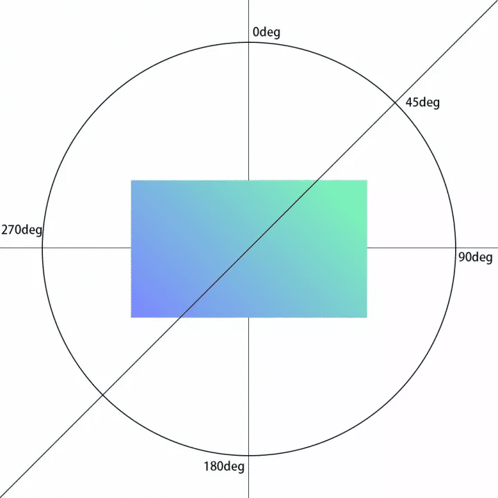

# apple_time
A countdown clock

心血来潮，想做一个苹果发布会的倒计时

## 前言

本网站基于github pages服务进行展示

## 过程

步骤如下：

1. 首先，网页标题来个标志性的苹果图标

- [一个好的图标网站](https://www.flaticon.com/free-icon/apple_152752#term=apple&page=1&position=2)

- [svg转换ico在线工具](https://cloudconvert.com/svg-to-ico)

如何为网站添加图标：

在\<head>标签中添加`<link rel="shortcut icon" href="favicon.ico">`，其会从项目根目录找favicon.ico文件

2. 主体布局

如果要背景铺满屏幕，来一个渐变色要怎么做呢

首先，为什么要用渐变，因为好看啊

其次，为什么渐变不用PS做的图片，因为CSS3提供了gradients属性，通过CSS实现其实渐变是由浏览器生成的，可以减少下载的事件和宽带的使用

既然渐变是浏览器生成的，就会涉及到不同浏览器的支持问题（Safari、Opera、Firefox等）

另外，渐变的方式分为两种：`线性渐变（Linear Gradients）`和`径向渐变（Radial Gradients）`，顾名思义，线性渐变是从一个*起点*沿着一个*方向*从一种颜色渐变成另一种颜色，而径向渐变是从一个*起点*沿着一个*角度*渐变

线性：linear-gradient

径向：radial-gradient

其参数对于不同的浏览器有着不同的写法，但基本都是在配置渐变方向和渐变首末的颜色

从上到下（默认）
```css
background: -webkit-linear-gradient(red, blue); /* Safari 5.1 - 6.0 */
background: -o-linear-gradient(red, blue); /* Opera 11.1 - 12.0 */
background: -moz-linear-gradient(red, blue); /* Firefox 3.6 - 15 */
background: linear-gradient(red, blue); /* 标准的语法 */
```

从左到右
```css
background: -webkit-linear-gradient(left, red , blue); /* Safari 5.1 - 6.0 */
background: -o-linear-gradient(right, red, blue); /* Opera 11.1 - 12.0 */
background: -moz-linear-gradient(right, red, blue); /* Firefox 3.6 - 15 */
background: linear-gradient(to right, red , blue); /* 标准的语法 */
```

左上角到右下角
```css
background: -webkit-linear-gradient(left top, red , blue); /* Safari 5.1 - 6.0 */
background: -o-linear-gradient(bottom right, red, blue); /* Opera 11.1 - 12.0 */
background: -moz-linear-gradient(bottom right, red, blue); /* Firefox 3.6 - 15 */
background: linear-gradient(to bottom right, red , blue); /* 标准的语法 */
```

> 注意：Internet Explorer 9 及之前的版本不支持渐变

上面的是指定方向，也可以指定角度，如下：

```css
background-image: linear-gradient(to top, #7A88FF, #7AFFAF);
/* 等价 */
background-image:linear-gradient(0deg, #7A88FF, #7AFFAF);
```

> 角度指的是过渡在哪个方向截止，浏览器会绘制一条经过元素中心点的假想线。指定的角度就是*这条线的角度*，同时还指明*过度在哪里结束*

|     |     |     |
| --- | --- | --- |
| 0deg | 表示元素的顶边 | to top |
| 90deg | 表示元素的右边 | to right |
| 180deg | 表示元素的底边 | to bottom |
| 270deg | 表示元素的左边 | to left |



如果仍然无法理解角度如何用，这里有一个[在线演示](https://codepen.io/thebabydino/full/qgoBL)

除此，透明度（transparent）使用

> CSS3 渐变也支持透明度（transparent），可用于创建减弱变淡的效果。

> 可使用 rgba() 函数来定义颜色结点。rgba() 函数中的最后一个参数可以是从 0 到 1 的值，它定义了颜色的透明度：0 表示完全透明，1 表示完全不透明。

如下为从左侧完全透明的红色到右侧完全不透明的红色

```css
background: -webkit-linear-gradient(left,rgba(255,0,0,0),rgba(255,0,0,1)); /* Safari 5.1 - 6 */
background: -o-linear-gradient(right,rgba(255,0,0,0),rgba(255,0,0,1)); /* Opera 11.1 - 12*/
background: -moz-linear-gradient(right,rgba(255,0,0,0),rgba(255,0,0,1)); /* Firefox 3.6 - 15*/
background: linear-gradient(to right, rgba(255,0,0,0), rgba(255,0,0,1)); /* 标准的语法 */
```

以上都是`线性渐变`

接下来是`径向渐变`

```css
radial-gradient(center, shape size, start-color, ..., last-color);
```

> 若不指定前面的参数，只指明颜色，则按照默认情况对颜色进行*均匀*分布

> 可以根据需求添加任意多个颜色。额外添加的颜色叫色标（color stop）

> 添加色标后，背景会从第一个颜色过渡到第二个颜色，再从第二个颜色过渡到第三个颜色，直到渐变的最后一个颜色为止。浏览器会平均分布各个颜色

```css
background: -webkit-radial-gradient(red, green, blue); /* Safari 5.1 - 6.0 */
background: -o-radial-gradient(red, green, blue); /* Opera 11.6 - 12.0 */
background: -moz-radial-gradient(red, green, blue); /* Firefox 3.6 - 15 */
background: radial-gradient(red, green, blue); /* 标准的语法 */
```

如下为背景色从左到右开始渐变，最左边是玫红，在元素宽度20%的位置变成青色，80%的位置变成黄色，最后是蓝色。

```css
linear-gradient(to right, #E94E65, #15A892 20%, #A89215 80%, #1574A8);
```

> 使用多色渐变时，第一个颜色和最后一个颜色无需指定位置，因为浏览器会嘉定第一个颜色从0%的位置开始，最后一个颜色在100%的位置结束。除非想把第一个颜色或最后一个颜色的位置放在指定的位置开始，才需要专门定位。

> 若想颜色不均匀分布，可手动对颜色增加权重

```css
background: -webkit-radial-gradient(red 5%, green 15%, blue 60%); /* Safari 5.1 - 6.0 */
background: -o-radial-gradient(red 5%, green 15%, blue 60%); /* Opera 11.6 - 12.0 */
background: -moz-radial-gradient(red 5%, green 15%, blue 60%); /* Firefox 3.6 - 15 */
background: radial-gradient(red 5%, green 15%, blue 60%); /* 标准的语法 */
```

> shape 参数定义了形状。它可以是值 circle 或 ellipse。其中，circle 表示圆形，ellipse 表示椭圆形。默认值是 ellipse。

```css
background: -webkit-radial-gradient(circle, red, yellow, green); /* Safari 5.1 - 6.0 */
background: -o-radial-gradient(circle, red, yellow, green); /* Opera 11.6 - 12.0 */
background: -moz-radial-gradient(circle, red, yellow, green); /* Firefox 3.6 - 15 */
background: radial-gradient(circle, red, yellow, green); /* 标准的语法 */
```

> repeating-radial-gradient() 函数用于重复径向渐变

```css
/* Safari 5.1 - 6.0 */
background: -webkit-repeating-radial-gradient(red, yellow 10%, green 15%);
/* Opera 11.6 - 12.0 */
background: -o-repeating-radial-gradient(red, yellow 10%, green 15%);
/* Firefox 3.6 - 15 */
background: -moz-repeating-radial-gradient(red, yellow 10%, green 15%);
/* 标准的语法 */
background: repeating-radial-gradient(red, yellow 10%, green 15%);
```

## 补充

使用vscode+搜狗输入法编辑本md文件上传至github后发现隐藏字符，形如：


查得[原因](https://www.zhihu.com/question/61638859)为

> 在mac版vscode的中文输入法下，按下任意字母，出现中文候选后按删除键，删除完刚才输入的字母再按删除会出现这个控制字符

mac版的vscode中这个隐藏字符默认隐藏，可通过修改如下配置打开，将文档中显示`BS`的退格符全局搜索并替换为空即可

```
//控制编辑器是否应呈现控制字符
"editor.renderControlCharacters": true
```

原理解析：`BS`为ASCII码中的退格符的Unicode表示法(所有ASCII[控制字符](https://en.wikipedia.org/wiki/Control_character)都有一个图形外观

参考链接：

[https://www.jianshu.com/p/58b340a037ea](https://www.jianshu.com/p/58b340a037ea)

[http://www.runoob.com/css3/css3-gradients.html](http://www.runoob.com/css3/css3-gradients.html)

